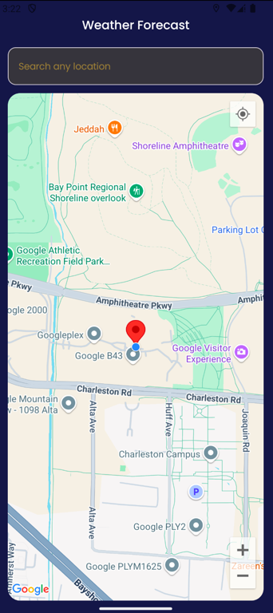
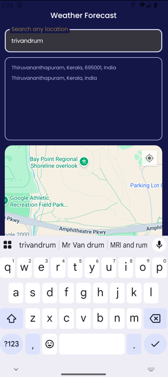
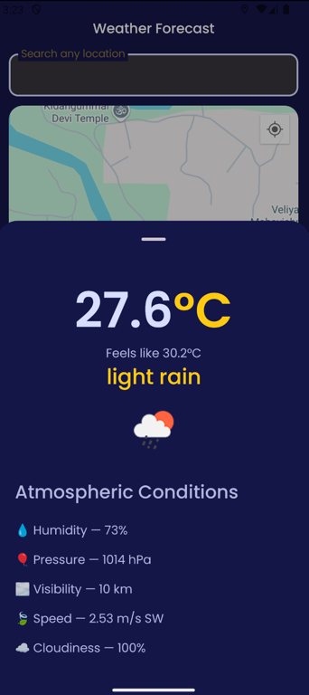

# 🌦️ Weather Forecast App

An Android application that displays weather forecasts using current location and search queries. It shows an interactive map with markers and weather data in a bottom sheet, built with Jetpack Compose and the latest modern Android libraries.

---

## 🚀 Features

- 🌍 Get weather for your current location or searched places
- 🗺️ Google Maps integration with live camera position
- 🔍 Location search with search results
- 🧭 Location permission handling with rationale & fallback
- 📦 Bottom sheet to display detailed weather info
- ⚡ Built using Jetpack Compose & modern Android architecture

## ✅ Setup Instructions

### 1️⃣ Create `secret.properties` in root of the project

This file is **not committed to version control** (via `.gitignore`). Create it manually with the following:
MAPS_API_KEY=your_maps_api_key
OPENWEATHER_API_KEY=your_openweather_api_key

## 📸 Screenshots

| Home                             | Search & Map | Weather Bottom Sheet         |
|----------------------------------|--------------|------------------------------|
|  |  |  |

